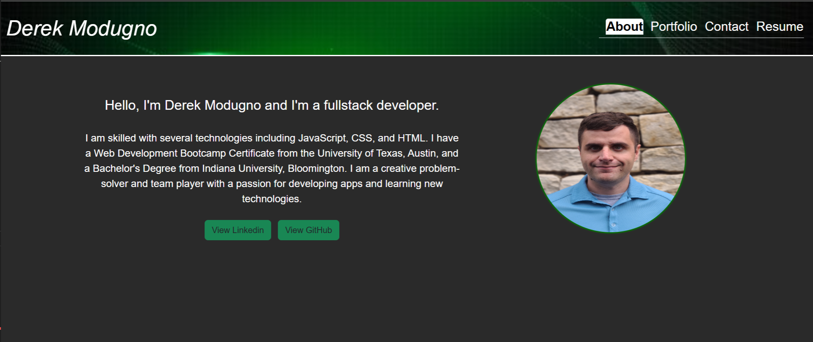

# reactPortfolio

## Description

- The aim of this project is to showcase a professional portfolio website developed using React. 
It serves as a platform for presenting my work portfolio to potential employers, providing them with insights into my skills and experiences.
Through this website, I offer an overview of my projects, resume, and contact information. 
This project has been instrumental in honing my skills in creating responsive web designs using React.

## Installation

No specific installation steps are required for this project.

## Usage

This webpage serves as a dynamic display of my professional portfolio with links to Projects, Contact Page, Resume, and About Me.

https://main--shimmering-parfait-ac6ce5.netlify.app/

## Credits

This project was independently developed.

## License

Please refer to the license file included in the repo.

---
