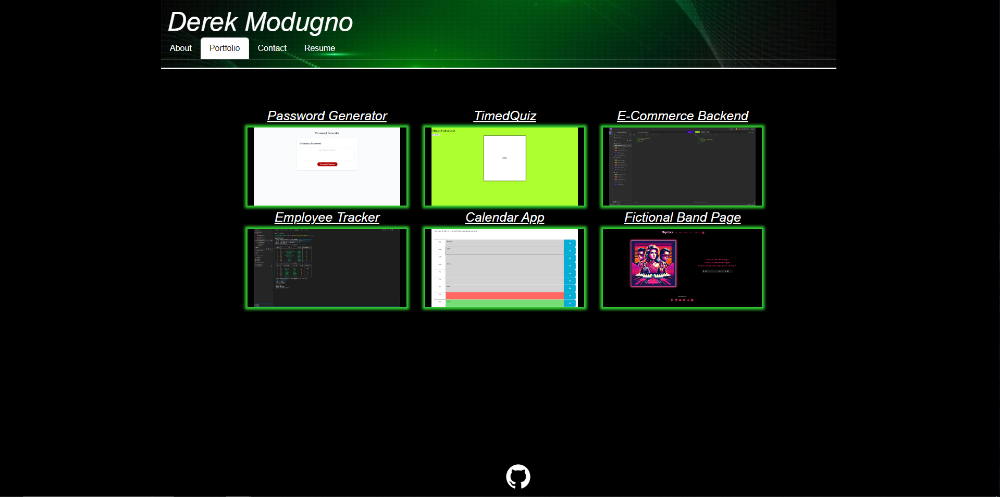

# reactPortfolio

## Description

- My goal for this project was to create a website with React. 
I created this project so that I could have a webpage that shows potential employers my work portfolio.
This website allows me to tell employers about me with links to my portfolio, resume, and contact page. 
This project taught me how to create a responsive portfolio using React.

## Installation

N/A

## Usage

This webpage shows my professional portfolio with links to my projects, contact page, resume, and about me.

https://main--shimmering-parfait-ac6ce5.netlify.app/

## Credits

N/A

## License

Please refer to the license in the repo.

---
